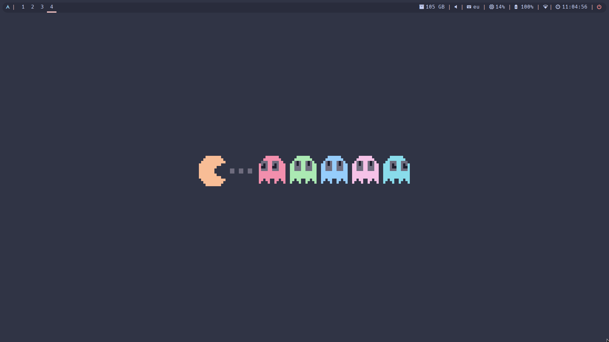

# wallshift

'wallshift' is a simple rust program that allows the user to have a wallpaper
that changes whenever the user wants. It can be used to change the wallpaper
every day, every hour, every minute, etc. It also allows the user to have an animated wallpaper.

## Dependencies

The only dependency is [feh](https://feh.finalrewind.org/), but I'm planning to allow
the user to choose the program to set the wallpaper.

## Installation

### Crates.io

Simply run:

```bash
cargo install wallshift
```

### Manual

The above method is recommended, but if you want to install it manually, you can do it like this:

```bash
git clone git@github.com:Yag000/wallshift.git
cd wallshift
cargo build --release
```

You will now have the binary in `target/release/wallshift`

## Usage

```bash
wallshift [OPTIONS]
```

### Options

- `-h`, `--help`: Prints help information
- '-s', `--seconds`: Sets the time in seconds to change the wallpaper
- '-m', `--minutes`: Sets the time in minutes to change the wallpaper
- '-g', '--get': Gets the next wallpaper
- '--betterlockscreen': Sets the betterlockscreen wallpaper as well
- '-t', '--toggle': Changes once the wallpaper

### Wallpaper directory

The default wallpaper directory is `$HOME/Pictures/Wallpapers`, but you can
change it in the config file (`$HOME/.config/wallshift/config.yaml`).

The directory must only contain images. If you wish to use animated wallpapers
(which are explained below), you must create a directory inside the wallpaper
directory with the same name as the animated wallpaper. Inside you must put the
images of the animated wallpaper, following this naming convention:

`<wallpaper-name><number>.<extension>`

Example for an animated wallpaper called 'example':

```
wallpaper-dir
|-- exampple
|   |-- example1.png
|   |-- example2.png
|   |-- example3.png
```

Hidden files (files starting with a dot) are ignored.

## Animated wallpapers

### What is an animated wallpaper?

I define an animated wallpaper as a collection of wallpapers that, if displayed
in a certain order, give the illusion of movement. For example, a collection of
images of a person walking or of pacman eating ghosts.

Example:


